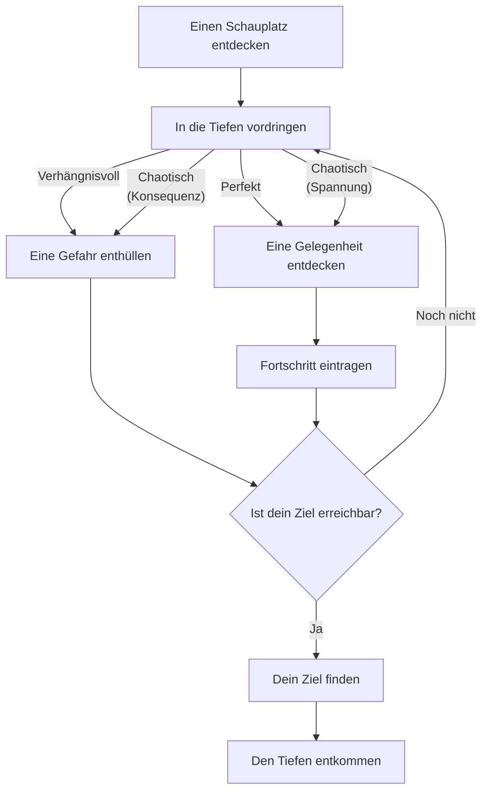

# Einleitung

Die folgenden Regeln adaptieren das Ironsworn: Delve System zur Erkundung von Schauplätzen für Grimwild.
Die zugehörigen Themen und Geländetypen sowie die Zufallstabellen der Aktionen sind in [[Delve.rdm]] hinterlegt.
## Gefährliche Schauplätze

Uralte Ruinen, tiefe Höhlen, geheimnisvolle Wälder, finstere Sümpfe die nur Wagemutige betreten.

**Einen Schauplatz entdecken**
Wenn du einen gefährlichen Schauplatz betrittst, um ein Ziel zu verfolgen:
1. Wähle ein **Thema** und **Geländetyp**, die den Schauplatz am besten beschreiben.  
2. Lege die **Schwierigkeit** des Ortes fest.  
3. Starte einen **Fortschrittspool** für diesen Ort.

## Bewohner (nicht verwendet)

Bevor du den Ort betrittst:
- Überlege, was man über diesen Ort weiß und  
- stelle dir vor, **wer oder was** darin leben könnte.  
- Notiere einige Beispiele, bevor du mit der Erkundung beginnst.

Auf dem **Delve-Bogen** am Ende dieses Dokuments findest du eine **Bewohner-Matrix**:
- Jedes Feld hat eine **Häufigkeit** (von „sehr häufig“ bis „unvorhergesehen“).  
- Besonders häufige Bewohner können mehrere Felder einnehmen.  

Wenn ein **Aktionsorakel** auf einen Bewohner verweist:
- Würfle `2dW+1D` und nutze das Ergebnis auf der Bewohner-Matrix.  
- Ein **Schnitt** verschiebt das Ergebnis um **ein Feld nach rechts**.
Nicht alle Bewohner sind feindselig – manche können hilfreich sein.

## Gefahren in der Tiefe (nicht verwendet)

In einem Schauplatz kannst du statt einer Konsequenz die Aktion _*eine Gefahr enthüllen*_ einsetzen.
Beim Einsatz von _*Eine Gefahr enthüllen*_:
- Würfle `d66` und nutze die **Gefahrentabelle**.
- Bei jedem Ergebnis, das eine **6** enthält, nutze die **Themen-Gefahren**.
- Bei jedem Ergebnis, das eine **5** enthält, nutze die **Geländetyp-Gefahren**.
- Alle anderen Ergebnisse beziehen sich auf die allgemeine Gefahrentabelle.

Wie bei anderen `d66`-Tabellen kannst du entscheiden, wie du das Ergebnis liest – z. B. aus einer 6 und 3 entweder **63** oder **36**.

# Fortschrittspools

Fortschrittspools sind Gruppen verknüpfter Aufgabenpools, mit denen du den Fortschritt für Ziele, Quests und Unternehmungen nachverfolgst. Anzahl und Größe der Pools hängen von der Schwierigkeit ab:

- **Lästig** – ein 4W-Pool  
- **Gefährlich** – zwei verknüpfte 4W-Pools  
- **Gewaltig** – +1 verknüpfter 6W-Pool  
- **Extrem** – +1 verknüpfter 6W-Pool  
- **Episch** – +1 verknüpfter 8W-Pool  

## Fortschritt nachverfolgen

- Der erste Aufgabenpool in der Kette ist der **aktive Aufgabenpool**, alle weiteren sind **gesperrt**.  
- Wenn du in der Fiktion etwas tust, das dein Ziel voranbringt, erreichst du einen _*Meilenstein*_ und würfelst den aktiven Pool nach den Regeln für **Diminishing Pools**.  
- Ist der aktive Pool aufgebraucht, wird der nächste Pool freigeschaltet und neuer aktiver Pool. So weiter, bis alle Pools aufgebraucht sind.

Wenn ein Aufgabenpool **0W** erreicht, sollte sich die Fiktion spürbar verändern. Wenn dir nichts einfällt, nutze ein Orakel oder _*eine Gelegenheit finden*_.

# Delve Aktionen

## In die Tiefen vordringen
Wenn du einen Abschnitt innerhalb eines gefährlichen Schauplatz durchquerst:
1. **Stell dir die Umgebung vor.**  
2. **Wähle deinen Ansatz:**

	- **Mit Eile** → `[Muskeln]`-Wurf mit `–1W`
	- **Mit Heimlichkeit** → `[Agilität]`-Wurf mit `–1D`  
	- **Mit Wachsamkeit oder Expertise** → normaler `[Verstand]`-Wurf
3. **Schwierigkeit des Schauplatz beachten:**

	- Aktiver Aufgabenpool **Gefährlich / Gewaltig** → `+1D`  
	- Aktiver Aufgabenpool **Extrem / Episch** → `+2D`  

### Ergebnis des Wurfs

- **Perfekt:** Trage Fortschritt ein und Entdecke eine Gelegenheit.
- **Chaotisch:** Trage Fortschritt ein und eine Konsequenz:
	- Der Spielleiter **enthüllt eine Gefahr** oder
	- Wählt der Spielleiter nimmt Verdacht und du entdeckst eine Gelegenheit.
- **Verhängnisvoll:** Du wirst von einem gefährlichen Ereignis aufgehalten **Enthülle eine Gefahr**.

### Besonderer Effekte

- Wenn du **mit Eile** navigierst und dabei **Fortschritt eintragen** kannst:
	- Jede gewürfelte **4** zählt wie eine **1** und wird aus dem Pool entfernt.
- Wenn du **mit Heimlichkeit** navigierst und dabei **Fortschritt eintragen** kannst:
	- Jede gewürfelte **3** zählt wie eine **4** und verbleibt im Pool.

## Eine Gelegenheit entdecken

Wenn du an einem Schauplatz eine hilfreiche Situation oder ein Merkmal vorfindest,
würfle auf die zugehörige Tabelle.
Wenn du die Gelegenheit sofort beim Schopf ergreifst, erhälst du Hilfe von Außen für deinen Aktionswurf.

## Eine Gefahr enthüllen
Wenn du an einem Schauplatz eine gefährliche Situation vorfindest, beschreibe
die Situation oder würfle auf die zugehörige Tabelle.

## Dein Ziel finden

Wenn alle Würfel eines Fortschrittspools verbraucht sind musst du den Fortschritt dieses Pools testen.
- Der Test beginnt mit **3W**.  
- Ziehe **–1d** für **jeden** Aufgabenpool ab, der noch nicht aufgebraucht ist.  
- Sind **alle** Aufgabenpools aufgebraucht, erhältst du zusätzlich **+1W**.  
- Würfle die Testwürfel und wende das Aktions­ergebnis an.

Wenn am Ende **keine Würfel** für den Test übrig bleiben, kannst du deinen Fortschritt derzeit nicht testen. Du kannst dein Ziel weiterverfolgen oder aufgeben.

- **Perfekt** – Du findest dein Ziel, und die Situation ist zu deinem Vorteil.
- **Chaotisch** – Du findest dein Ziel und musst Deliver Impact ausführen.
- **Verhängnisvoll** – Dein Ziel gerät außer Reichweite, du wurdest über die Natur des Ziels getäuscht oder entdeckst weitere unerforschte Tiefen des Sites.

Entscheidest du dich weiterzumachen, setzt du den Fortschritt zurück und erhöhst die Schwierigkeit um 1.

## Aus den Tiefen entkommen

Wenn du von einem Schauplatz fliehst oder dich zurückziehst, überlege dir die
Situation und lege einen **Montage-Wurf** ab.
- **Perfekt** – Du entkommst dem Ort sicher.  
- **Chaotisch** – Du entkommst, musst aber mit einer **Konsequenz**.  
- **Verhängnisvoll** – Eine massive Bedrohung oder unüberwindbar wirkende Hürde stellt sich dir in den Weg. Du **enthüllst eine Gefahr**. Überlebst du, gelingt dir die Flucht.

## Zu einem Schauplatz zurückkehren

Wenn du einen Schauplatz verlassen hast und später die Erkundung fortsetzen willst, kannst du den bestehenden **Fortschrittspool** weiterverwenden – aber nicht vollständig.
Gehe wie folgt vor:
1. **Setze den aktiven Aufgabenpool zurück.**  
2. **Würfle alle erschöpften Aufgabenpools neu.**  
3. Alle Würfel, die dabei **nicht gestrichen** werden, füllen die erschöpften Aufgabenpools wieder auf – beginnend mit der **höchsten Schwierigkeit** und dann rückwärts.
## Flowchart

# Delve-Bogen

**Schauplatzname:**
**Ziel:**
**Thema:**
**Geländetyp:**

| Schwierigkeit      | Lästig    → | Gefährlich   →   | Gewaltig         →    | Extrem           →      | Episch                          |
|--------------------|------------|-----------------|----------------------|------------------------|----------------------------------|
| Würfelpool        | 4W     | 4W          | 6W      | 6W        | 8W        |
| Dornen     | -        | 1D            | 1D                  |2D                   | 2D                             |